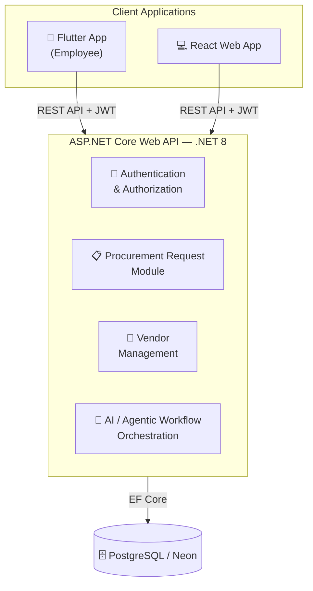
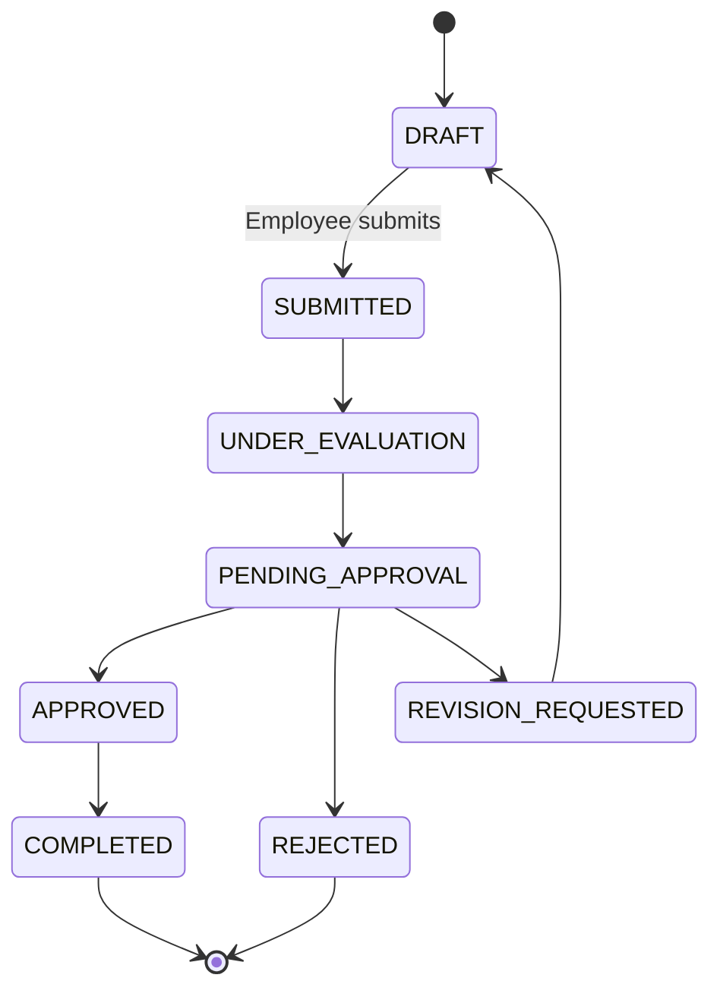
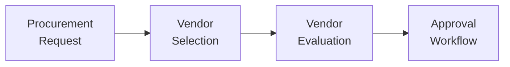
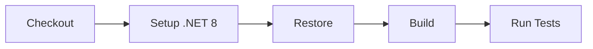
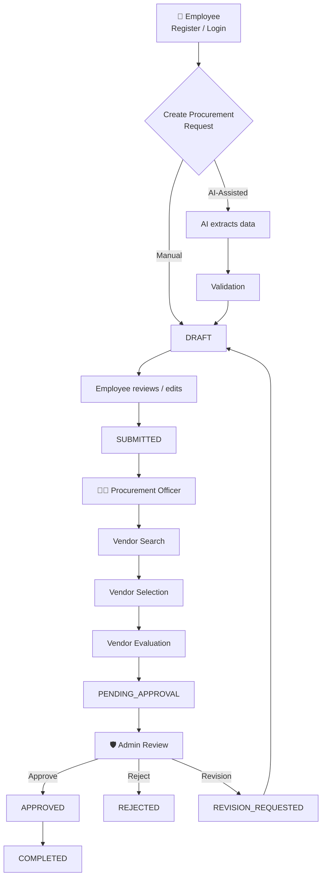
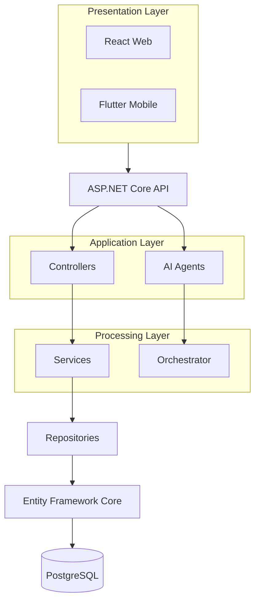

# Procura

> AI-Assisted Procurement Management System

Procura is a modular procurement management system designed to streamline the process of creating, reviewing, evaluating, and approving procurement requests.

The system provides role-based access for Employees, Procurement Officers, and Administrators, with an AI-assisted procurement request workflow that converts natural-language requirements into structured procurement requests.

---

## Project Status

| Component | Status |
|---|---|
| Authentication & Authorization | ✅ Implemented |
| Procurement Request Backend | ✅ Implemented |
| Procurement Request Web Frontend | ✅ Implemented |
| Procurement Request Flutter App | ✅ Implemented |
| Procurement Request AI Agent | ✅ Implemented |
| PostgreSQL / EF Core Integration | ✅ Implemented |
| Vendor Management Backend | ✅ Implemented |
| Vendor Management Web Frontend | 🔄 In Progress |
| Vendor Evaluation & Recommendation | 🔄 In Progress |
| Approval Workflow | 🔄 In Progress |
| Backend Automated Tests | ✅ Passing |
| GitHub Actions Backend CI | ✅ Passing |
| Production Deployment | 🔄 In Progress |

---

## System Overview

Procura follows a modular monolith architecture. The backend acts as the central system of record — both the React web application and Flutter mobile application communicate with the same ASP.NET Core API and PostgreSQL database.



---

## Technology Stack

### Backend
- .NET 8
- ASP.NET Core Web API
- Entity Framework Core
- PostgreSQL
- JWT Authentication
- Role-Based Authorization
- Swagger / OpenAPI
- xUnit
- Moq

### Web Frontend
- React
- JavaScript
- REST API
- JWT-based authentication
- Responsive web UI

### Mobile Frontend
- Flutter
- Dart
- Dio / HTTP API communication
- Android

### AI
- LLM-powered procurement request processing
- Natural-language request extraction
- Structured procurement request generation
- Agentic workflow architecture
- Central workflow orchestration

### DevOps
- Git / GitHub
- GitHub Actions
- Docker-ready backend
- PostgreSQL / Neon
- Environment-based configuration

---

## User Roles

Procura currently uses three primary application roles.

### Employee

**Can:**
- Register and log in
- Create procurement requests (manual or AI-assisted)
- Review AI-generated procurement requests
- Edit their own draft requests
- Submit procurement requests
- View their submitted requests
- Respond to AI clarification requests
- Revise requests when revision is requested

**Cannot:**
- Approve or reject procurement requests
- Manage or evaluate vendors
- Modify or delete submitted requests

### Procurement Officer

Responsible for the procurement processing stage. Can:
- View procurement requests relevant to procurement processing
- Manage vendors, search for and select suitable vendors
- Evaluate procurement options
- Move requests through the evaluation process
- Submit completed evaluations for approval
- Complete approved procurement requests

### Administrator

Provides system-level oversight. Can:
- View procurement requests and review requests pending approval
- Approve, reject, or request revisions on requests
- Manage users and roles
- Manage vendors
- Perform administrative oversight

---

## Authentication

Procura uses JWT-based authentication.

**Registration:** Public registration does not allow users to select an arbitrary role. New registrations are automatically assigned `EMPLOYEE`. Administrative and Procurement Officer roles are managed by authorized administrators.

**Login:** Users authenticate through the login endpoint and receive a JWT containing identity and authorization claims (User ID, Email, Role, First name, Last name, Display name).

```http
Authorization: Bearer <token>
```

---

## Procurement Request Workflow

The procurement request lifecycle is controlled by explicit status transitions.



### Lifecycle rules

| Status | Description |
|---|---|
| **DRAFT** | The Employee can edit, delete, review AI-generated info, and submit the request. |
| **SUBMITTED** | Locked for the Employee (no further edits or deletion). Proceeds to procurement processing. |
| **UNDER_EVALUATION** | The Procurement Officer handles vendor-related processing and evaluation. |
| **PENDING_APPROVAL** | The request is waiting for administrative approval. |
| **APPROVED** | The request has been approved and can proceed toward completion. |
| **REJECTED** | The procurement request has been rejected. |
| **REVISION_REQUESTED** | The Administrator requests changes; the request returns to `DRAFT` for the Employee to revise and resubmit. |
| **COMPLETED** | The procurement workflow has been completed. |

---

## AI-Assisted Procurement Requests

Instead of manually filling every field, an Employee can describe the requirement using natural language, for example:

> "We need 20 laptops for the new software engineering team. They should have at least 16GB RAM, 512GB SSD storage, and should be available within the next month."

The AI processing workflow extracts structured information such as: request title, description, justification, priority, required-by date, estimated total, procurement items, quantity, unit, and estimated unit price.

The AI then validates the extracted information. If sufficient information is available, the system creates a **DRAFT**. The Employee must review the generated request before explicitly submitting it.

> **Note:** The AI does *not* automatically submit, approve, reject, or delete procurement requests.

---

## AI Workflow

Procura separates AI workflow execution from the procurement request lifecycle. The central orchestrator coordinates the AI stages:



Possible workflow outcomes include:

- `STAGE_COMPLETED`
- `NEEDS_USER_INPUT`
- `FAILED`
- `WAITING_FOR_HUMAN_APPROVAL`

> A completed AI stage does not automatically mean the procurement request itself has been approved. Human authorization remains part of the procurement workflow.

---

## Procurement Request API

| Method & Path | Description |
|---|---|
| `POST /api/procurement-requests` | Creates a procurement request. |
| `GET /api/procurement-requests` | Retrieves procurement requests accessible to the authenticated user. |
| `GET /api/procurement-requests/{id}` | Retrieves a specific procurement request. |
| `PUT /api/procurement-requests/{id}` | Updates an editable procurement request (restricted by ownership and lifecycle status). |
| `DELETE /api/procurement-requests/{id}` | Deletes an eligible draft request (owner only). |
| `POST /api/procurement-requests/{id}/submit` | Submits an Employee's draft request. |
| `POST /api/procurement-requests/{id}/status?newStatus={status}` | Updates the procurement request status per allowed lifecycle transitions and authorization rules. |

## AI Procurement Request API

| Method & Path | Description |
|---|---|
| `POST /api/procurement-requests/ai/process` | Processes a natural-language procurement request: interprets the request, extracts structured info, validates it, asks for clarification if needed, and creates a draft. The result stays a draft until explicitly submitted. |
| `GET /api/procurement-requests/ai/workflows/{id}` | Retrieves the current state of an AI procurement workflow. |

---

## Vendor Management

The backend currently includes:
- Vendor entity, repository, service, and controller
- Vendor selection functionality
- Vendor search AI tooling
- Vendor selection AI tooling

The web interface for Vendor Management is currently being aligned with the backend API. The Employee Flutter application does not manage vendors, since vendor management is an operational responsibility of Procurement Officers and Administrators.

---

## Project Structure

```text
Procura/
│
├── backend/
│   ├── Procura.API/
│   │   ├── AI/
│   │   │   ├── Agents/
│   │   │   ├── Tools/
│   │   │   └── Orchestration/
│   │   │
│   │   ├── Modules/
│   │   │   ├── ProcurementRequest/
│   │   │   │   ├── Controllers/
│   │   │   │   ├── DTOs/
│   │   │   │   ├── Entities/
│   │   │   │   ├── Enums/
│   │   │   │   ├── Repositories/
│   │   │   │   └── Services/
│   │   │   │
│   │   │   └── VendorManagement/
│   │   │       ├── Controllers/
│   │   │       ├── DTOs/
│   │   │       ├── Entities/
│   │   │       ├── Repositories/
│   │   │       └── Services/
│   │   │
│   │   ├── Shared/
│   │   ├── Migrations/
│   │   └── Program.cs
│   │
│   └── Procura.Tests/
│
├── frontend-web/
│   ├── src/
│   │   ├── components/
│   │   ├── pages/
│   │   ├── services/
│   │   └── ...
│   ├── package.json
│   └── package-lock.json
│
├── frontend-mobile/
│   ├── lib/
│   │   ├── screens/
│   │   ├── services/
│   │   ├── models/
│   │   └── ...
│   ├── test/
│   └── pubspec.yaml
│
├── .github/
│   └── workflows/
│       └── ci.yml
│
└── README.md
```

---

## Running the Project Locally

### Prerequisites

- .NET 8 SDK
- PostgreSQL or access to the configured Neon PostgreSQL database
- Node.js and npm
- Flutter SDK
- Android Studio / Android SDK for mobile development
- Git

### 1. Clone the Repository

```bash
git clone https://github.com/AlgoDove/Procura.git
cd Procura
```

Always work from the latest `main` branch before starting new component work.

```bash
git checkout main
git pull origin main
```

### 2. Configure the Backend

The backend requires database and authentication configuration through environment-specific configuration.

Do **not** commit:
- `.env`
- API keys
- Database passwords
- Connection strings containing credentials
- JWT secrets
- Gemini/API credentials

Use local configuration, environment variables, or .NET user secrets.

### 3. Run the Backend

```bash
dotnet run --project backend/Procura.API
```

The API will start on the configured HTTP/HTTPS development ports. Swagger/OpenAPI is available through the API's Swagger endpoint during development.

### 4. Run the React Web Application

```bash
cd frontend-web
npm install
npm run dev
```

The Vite development server will display the local URL in the terminal.

### 5. Run the Flutter Application

```bash
cd frontend-mobile
flutter pub get
```

For an Android emulator:

```bash
flutter run --dart-define=API_URL=http://10.0.2.2:5071
```

For a physical Android device on the same local network as the development machine:

```bash
flutter run --dart-define=API_URL=http://<YOUR_LAN_IP>:5071
```

Replace `<YOUR_LAN_IP>` with the current development machine's LAN IP address. Do not hard-code a developer-specific LAN IP into the repository.

---

## Testing

### Backend

```bash
dotnet test backend/Procura.sln
```

Current verified result:

```text
77 tests passed
0 failed
0 skipped
```

### React

```bash
npm --prefix frontend-web test
```

Current verified result: `13 tests passed`

Build the React application:

```bash
npm --prefix frontend-web run build
```

### Flutter

```bash
cd frontend-mobile
flutter analyze lib/
flutter test
```

Current verified result:

```text
Flutter analysis: 0 issues
Flutter tests: 6 passed
```

---

## Continuous Integration

The repository contains a GitHub Actions workflow for the required backend CI pipeline, which runs on pushes to `main` and pull requests targeting `main`.



Workflow file: `.github/workflows/ci.yml`

The project intentionally keeps the GitHub Actions workflow focused on the required backend CI pipeline. Frontend tests and builds can still be performed locally during development.

---

## Database

Procura uses PostgreSQL as its relational database. Entity Framework Core is used for database access, entity mapping, relationships, migrations, and persistence.

The system is compatible with a hosted PostgreSQL provider such as Neon. The database should be configured through environment-specific settings. Never commit database credentials to Git.

---

## Security

**JWT Authentication** — Authenticated API requests require a valid JWT:

```http
Authorization: Bearer <JWT>
```

**Role-Based Authorization** — API endpoints are protected according to user roles: `EMPLOYEE`, `PROCUREMENT_OFFICER`, `ADMIN`.

**Ownership Enforcement** — Employee-owned procurement requests are protected at the service/API level (e.g., an Employee cannot manipulate another Employee's draft request).

**Lifecycle Enforcement** — Procurement requests cannot arbitrarily jump between statuses; allowed transitions are validated by the backend.

**Secrets** — Sensitive configuration must remain outside source control, including database credentials, JWT signing secrets, AI API keys, and production connection strings.

---

## Git Workflow

Development should use feature branches rather than directly modifying `main`.

```bash
git checkout main
git pull origin main

git checkout -b feature/procurement-evaluation
```

After implementation:

```bash
git add .
git commit -m "feat: implement vendor evaluation"
git push origin feature/procurement-evaluation
```

Then create a Pull Request targeting `main`.

Use meaningful commits such as:

```text
feat: add vendor evaluation endpoints
fix: correct vendor contact field mapping
test: add procurement lifecycle tests
refactor: simplify vendor service
docs: update procurement workflow
```

---

## Integration Rules

Because Procura is a shared group project, existing functionality should not be unnecessarily rewritten.

Before implementing a new component:

1. Pull the latest `main`.
2. Run the existing backend.
3. Run the React application.
4. Run the Flutter application if relevant.
5. Verify the existing Procurement Request workflow.
6. Understand the existing API contracts.
7. Implement the new component within the existing architecture.
8. Test the component independently.
9. Test the complete end-to-end workflow.
10. Open a Pull Request for integration.

Existing functionality includes authentication, authorization, Procurement Request processing, AI-assisted request creation, and shared database infrastructure. New components should integrate with these systems rather than replacing them.

---

## End-to-End Business Flow



---

## AI and Human-in-the-Loop Principles

AI is used to assist procurement operations, not to bypass authorization controls.

**The AI may:**
- Extract information
- Structure natural-language requirements
- Validate information
- Search for vendors
- Generate recommendations
- Provide workflow assistance

**The AI must not:**
- Automatically approve a procurement request
- Automatically reject a procurement request
- Bypass role authorization
- Silently modify procurement lifecycle state

Human users remain responsible for authorization-sensitive decisions.

---

## Current Development Boundaries

The Procurement Request component is implemented across the ASP.NET Core Backend, React Web Frontend, Flutter Mobile Frontend, PostgreSQL, the AI Procurement Request Agent, and Automated Tests.

**Remaining major development areas:**
- Vendor Management Web Frontend
- Vendor Evaluation & Recommendation
- Approval Workflow
- Remaining AI Agents
- Full Integration Testing
- Production Application Deployment
- Documentation

These components should build on the existing authentication, Procurement Request, database, and orchestration infrastructure.

---

## Troubleshooting

### Backend does not start

Check:
- .NET 8 SDK
- Database configuration
- Connection string
- Required environment variables
- Port availability

Then run:

```bash
dotnet build backend/Procura.sln
```

### React cannot connect to API

Check:
- Backend is running
- API URL is correct
- CORS configuration
- JWT authentication
- Frontend environment configuration

### Flutter cannot connect to localhost

Android emulators do not use the host machine's `localhost`. Use `10.0.2.2` instead. For a physical device, use the development machine's LAN IP and ensure both devices are on the same network.

### AI request remains stuck

Check the workflow status returned by the API. Important terminal states:

- `STAGE_COMPLETED` — the AI stage completed successfully. The client should retrieve or navigate to the resulting procurement request rather than treating the workflow as still running.
- `FAILED` — inspect the workflow error information returned by the API.
- `NEEDS_USER_INPUT` — the Employee must provide the requested clarification.

---

## API Documentation

During local development, Swagger/OpenAPI can be used to inspect and test available API endpoints.

```bash
dotnet run --project backend/Procura.API
```

Then open the Swagger URL displayed by ASP.NET Core. Swagger provides endpoint documentation, request/response schemas, authorization testing, and API exploration.

---

## Development Principles

- Modular backend organization
- Clear separation of controllers, services, repositories, and entities
- DTO-based API contracts
- JWT authentication
- Role-based authorization
- Backend-enforced lifecycle rules
- Human-in-the-loop AI decisions
- Shared API between web and mobile clients
- Automated backend testing
- GitHub-based collaboration
- CI validation before merging
- Environment-based secret management

---

## Project Architecture



This structure allows the individual procurement modules to evolve independently while sharing common authentication, database, and workflow infrastructure.

---

## Repository

GitHub repository: [https://github.com/AlgoDove/Procura](https://github.com/AlgoDove/Procura)

---

## License

This project was developed as part of an academic Software Engineering project at SLIIT. Unless otherwise specified, the source code is intended for academic/project use.
