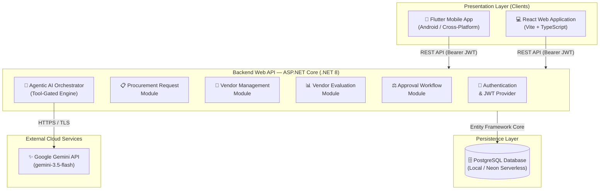
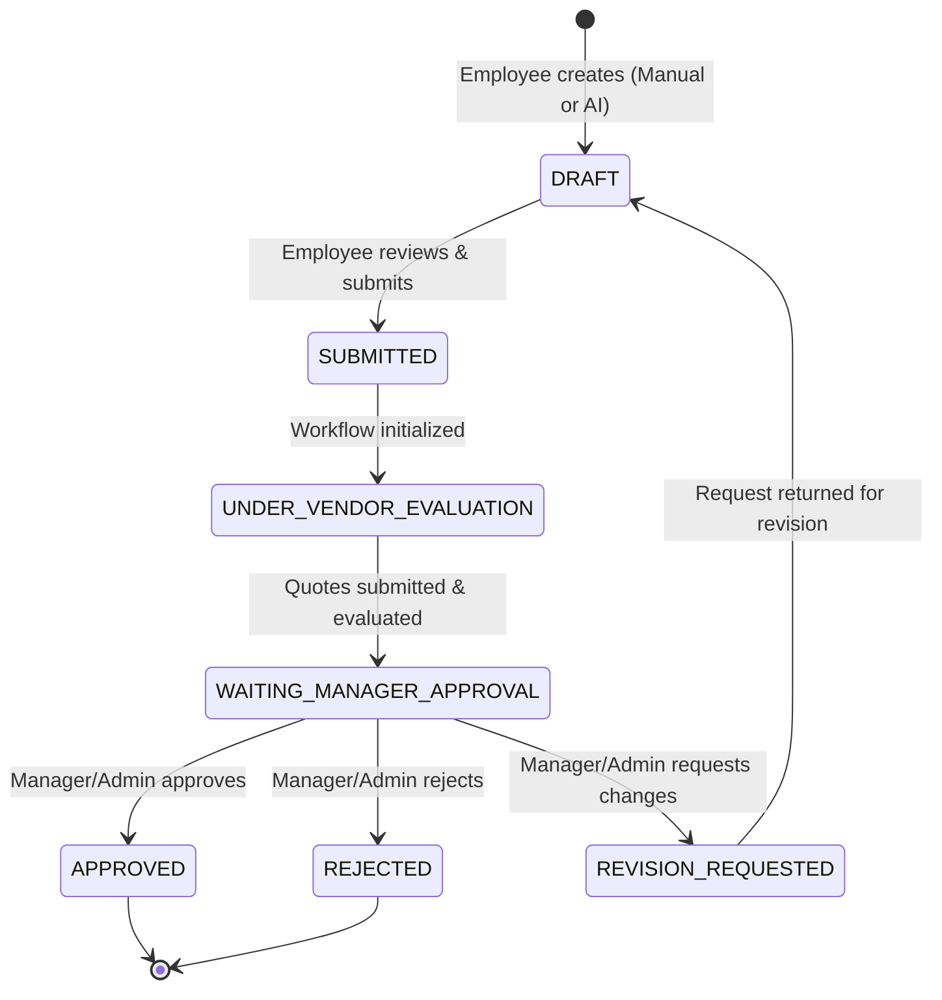
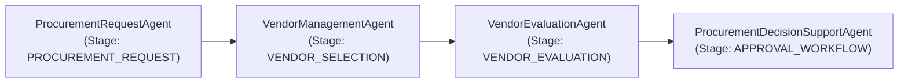

# Procura

> AI-Assisted Enterprise Procurement Management System

Procura is a modular procurement management system designed to streamline the end-to-end procurement lifecycle — from natural-language request formulation and vendor quote collection to automated multi-criteria evaluation and administrative governance.

The system enforces role-based access for Employees, Procurement Officers, Managers, and Administrators, integrating an Agentic AI subsystem powered by Google Gemini to accelerate draft creation, evaluate supplier quotes, and assist approval decisions while guaranteeing human-in-the-loop oversight.

---

## Project Status

| Component | Module Ownership / Subsystem | Status |
|---|---|---|
| **Authentication & Authorization** | Core Shared Platform | ✅ Implemented & Verified |
| **Procurement Request Module** | Component 1 — Request Lifecycle & AI Drafting | ✅ Implemented & Verified |
| **Vendor Management Module** | Component 2 — Vendor Catalog & Directory | ✅ Implemented & Verified |
| **Vendor Evaluation Module** | Component 3 — Quote Scoring & AI Recommendation | ✅ Implemented & Verified |
| **Approval Workflow Module** | Component 4 — Multi-Stage Governance & Audit Trail | ✅ Implemented & Verified |
| **PostgreSQL & EF Core Schema** | Database Layer | ✅ Synchronized (0 Pending Migrations) |
| **Backend Automated Tests** | .NET 8 Test Suite | ✅ 217 Passing / 0 Failed |
| **Web Frontend Automated Tests** | React Vitest Suite | ✅ 17 Passing / 0 Failed |
| **Mobile Frontend Tests & Analysis**| Flutter Test Suite | ✅ 9 Passing / 0 Issues |
| **GitHub Actions CI Pipeline** | Minimal Backend CI | ✅ Passing on `main` |
| **Production Deployment Preparation**| Release Builds & Config Hardening | ✅ Ready for Deployment Configuration |

---

## System Overview & Architecture

Procura is architected as a modular monolith backend with unified web and mobile clients:


```mermaid
flowchart TB
    subgraph Clients["Presentation Layer (Clients)"]
        direction LR
        Flutter["📱 Flutter Mobile App<br/>(Android / Cross-Platform)"]
        React["💻 React Web Application<br/>(Vite + TypeScript)"]
    end

    subgraph Gateway["Backend Web API — ASP.NET Core (.NET 8)"]
        direction LR
        Auth["🔐 Authentication<br/>& JWT Provider"]
        PR["📋 Procurement Request<br/>Module"]
        VM["🏢 Vendor Management<br/>Module"]
        VE["📊 Vendor Evaluation<br/>Module"]
        AW["⚖️ Approval Workflow<br/>Module"]
        AI["🤖 Agentic AI Orchestrator<br/>(Tool-Gated Engine)"]
    end

    subgraph Data["Persistence Layer"]
        DB[("🗄️ PostgreSQL Database<br/>(Local / Neon Serverless)")]
    end

    subgraph External["External Cloud Services"]
        Gemini["✨ Google Gemini API<br/>(gemini-3.5-flash)"]
    end

    Flutter -- "REST API (Bearer JWT)" --> Gateway
    React -- "REST API (Bearer JWT)" --> Gateway
    Gateway -- "Entity Framework Core" --> DB
    AI -- "HTTPS / TLS" --> Gemini
```

### Architectural Principles
* **Single Central Gateway:** The ASP.NET Core Web API is the single source of truth. Frontends never access PostgreSQL or Google Gemini directly.
* **Separation of Concerns:** Controllers handle HTTP routing and validation; services manage business logic and state machines; repositories abstract data access via EF Core.
* **Stateless Authentication:** All protected endpoints require a cryptographically signed JWT token passed via HTTP `Authorization: Bearer <token>` headers.
* **Deterministic Guardrails:** AI LLM responses are parsed and deterministically validated by business logic rules before persisting changes to the database.

---

## Technology Stack

### Backend
* **Runtime & Framework:** .NET 8 (C# 12) / ASP.NET Core Web API
* **Data Access & ORM:** Entity Framework Core 8.0, Npgsql.EntityFrameworkCore.PostgreSQL
* **Database:** PostgreSQL (supports local PostgreSQL 15+ and cloud Neon Serverless PostgreSQL)
* **Authentication:** JWT (JSON Web Tokens) with HMAC-SHA256 signature verification and BCrypt password hashing
* **API Documentation:** Swagger / OpenAPI with interactive Bearer token support
* **Testing:** xUnit, Moq, Microsoft.AspNetCore.Mvc.Testing

### Web Frontend
* **Framework:** React 18 with TypeScript
* **Build Tool:** Vite 8
* **Routing:** React Router DOM (v6)
* **Server State Management:** TanStack Query (React Query)
* **HTTP Client:** Axios with JWT request interceptors and 401 token invalidation
* **Testing:** Vitest, React Testing Library, jsdom

### Mobile Frontend
* **Framework:** Flutter 3.x (Dart 3.x)
* **State Management:** Provider pattern
* **Networking:** HTTP client with JWT interceptor, configurable via `--dart-define`
* **Target Platforms:** Android (minSdkVersion 21+, targetSdkVersion 34+)

### Agentic AI Subsystem
* **Provider:** Google Gemini API (`gemini-3.5-flash`)
* **Orchestration:** Native ASP.NET Core `CentralOrchestrator` with stage routing
* **Security & Sandboxing:** Registered tools (`ToolRegistry`) with role execution contexts and validation gates

---

## Repository Structure

```text
Procura/
├── backend/
│   ├── Procura.API/                    # ASP.NET Core Web API project
│   │   ├── AI/                         # Agentic AI subsystem
│   │   │   ├── Agents/                 # Specialized domain agents
│   │   │   │   ├── ApprovalWorkflow/   # Decision support & readiness agents
│   │   │   │   ├── ProcurementRequest/ # Request extraction agent & tools
│   │   │   │   ├── VendorEvaluation/   # Vendor scoring & recommendation agent
│   │   │   │   └── VendorManagement/   # Natural-language vendor selection intent agent & tools
│   │   │   ├── Core/                   # Agent contracts, ToolRegistry, WorkflowContext
│   │   │   ├── Gemini/                 # Native Gemini API client & configuration
│   │   │   ├── Orchestration/          # CentralOrchestrator workflow coordinator
│   │   │   └── Persistence/            # Workflow instance repositories
│   │   ├── Migrations/                 # EF Core PostgreSQL database migrations
│   │   ├── Modules/                    # Core business modules
│   │   │   ├── ApprovalWorkflow/       # Workflow state machine, decisions, audit trail
│   │   │   ├── ProcurementRequest/     # Procurement requests CRUD & item tracking
│   │   │   ├── VendorEvaluation/       # Vendor quotes, criterion scoring, rankings
│   │   │   └── VendorManagement/       # Vendor catalog & company management
│   │   ├── Shared/                     # Auth, Users, Middleware, DB Context
│   │   ├── Program.cs                  # Dependency Injection, Middleware, Pipeline
│   │   └── appsettings.json            # Configuration template (no credentials)
│   ├── Procura.API.Tests/              # Backend xUnit test suite
│   └── Procura.sln                     # .NET solution file
│
├── frontend-web/                       # React Web Application
│   ├── src/
│   │   ├── api/                        # Axios API client & REST endpoints
│   │   ├── components/                 # Reusable UI components & modals
│   │   │   ├── approvals/              # Approval workflow cards & audit modals
│   │   │   └── vendor-evaluation/      # Quote modals & comparison tables
│   │   ├── context/                    # AuthContext with client-side JWT decoding
│   │   ├── pages/                      # Page views for all four modules
│   │   └── test/                       # Vitest component & unit tests
│   ├── .env.example                    # Template for local development variables
│   ├── package.json                    # Dependencies & scripts
│   └── vite.config.ts                  # Vite build configuration
│
├── frontend-mobile/                    # Flutter Mobile Application
│   ├── android/                        # Native Android host configuration
│   │   └── app/src/main/AndroidManifest.xml # Permissions (INTERNET)
│   ├── lib/
│   │   ├── models/                     # Strongly-typed API DTO models
│   │   ├── providers/                  # AuthProvider state
│   │   ├── screens/                    # Mobile screens for all workflows
│   │   │   └── widgets/                # Workflow, items, and evaluation cards
│   │   ├── services/                   # ApiClient and AuthService
│   │   ├── config.dart                 # Dynamic API URL loader (--dart-define)
│   │   └── main.dart                   # Application entry point & theme
│   ├── test/                           # Flutter widget tests
│   └── pubspec.yaml                    # Flutter dependencies
│
├── .github/
│   └── workflows/
│       └── ci.yml                      # GitHub Actions backend CI pipeline
│
└── README.md                           # Master system documentation
```

---

## Four Major Module Responsibilities

The system is organized into four core functional components, aligning with academic project division:

### 1. Procurement Request Subsystem (Component 1)
* Manages creation, modification, deletion, and submission of procurement requests and line items.
* Integrates `ProcurementRequestAgent` to parse natural-language specifications into structured line items (name, description, quantity, unit, estimated unit price).
* Provides deterministic pre-validation (`ProcurementRequestDeterministicValidator` / `ValidateDraftDataTool`) to guarantee positive numbers and required fields.
* Restricts AI outputs to `DRAFT` status; employees retain exclusive authority to review and formally submit.

### 2. Vendor Management Subsystem (Component 2)
* Maintains a centralized catalog of certified suppliers and vendors.
* Tracks company name, contact person, verified email address, phone number, category, physical address, and performance rating (0–5).
* Exposes CRUD APIs for procurement officers and administrators with comprehensive validation.
* Supported by full Web and Mobile interfaces (list, detail, create, edit).
* Integrates `VendorManagementAgent` (`WorkflowStage.VENDOR_SELECTION`) to extract vendor selection intent from natural-language workflow objectives, search the certified catalog via `SearchVendorsTool`, validate active status via `VendorManagementDeterministicValidator`, and link candidate vendors via `SelectVendorTool`.

### 3. Vendor Evaluation Subsystem (Component 3)
* Collects and manages multiple competitive vendor quotes against submitted procurement requests.
* Provides deterministic multi-criteria scoring across price, delivery speed, and vendor quality.
* Integrates `VendorEvaluationAgent` to synthesize comparative analysis and generate objective executive recommendations.
* Displays a vendor comparison matrix in the web interface and mobile recommendation cards.

### 4. Approval Workflow Subsystem (Component 4)
* Controls the strict multi-stage governance state machine:
  `DRAFT` → `SUBMITTED` → `UNDER_VENDOR_EVALUATION` → `WAITING_MANAGER_APPROVAL` → `APPROVED` / `REJECTED` / `REVISION_REQUESTED`.
* Manages binding approval decisions by authorized Managers and Administrators with recorded commentary.
* Integrates `ProcurementDecisionSupportAgent` to generate executive briefs and assess approval readiness.
* Maintains an immutable audit trail (`WorkflowAuditTrailResponse`) recording every human action, automated status transition, and AI agent execution.

---

## User Roles & Permissions

| Role | Intended Platform | Permissions & Capabilities | Explicit Restrictions |
|---|---|---|---|
| **EMPLOYEE** | Flutter Mobile / React Web | • Register & login<br/>• Create manual/AI requests<br/>• Edit & delete owned drafts<br/>• Submit draft requests<br/>• Track business status | • Cannot approve/reject requests<br/>• Cannot manage vendors<br/>• Cannot initialize approval workflows for others |
| **PROCUREMENT_OFFICER** | React Web | • View submitted requests<br/>• Initialize approval workflows<br/>• Manage vendor catalog<br/>• Submit vendor quotes<br/>• Trigger AI vendor evaluation | • Cannot make final manager approval decisions<br/>• Cannot manage system user roles |
| **MANAGER** | React Web | • Review pending requests (`WAITING_MANAGER_APPROVAL`)<br/>• Inspect AI vendor recommendations<br/>• Issue binding approval decisions (`APPROVE`, `REJECT`, `REVISION_REQUESTED`) | • Cannot modify employee request line items directly |
| **ADMIN** | React Web | • Full system oversight<br/>• Manage user accounts and roles (`ADMIN` endpoint)<br/>• Override workflow decisions<br/>• Manage vendors and requests | • None |

---

## Procurement Request Lifecycle & State Transitions


```mermaid
stateDiagram-v2
    [*] --> DRAFT: Employee creates (Manual or AI)
    DRAFT --> SUBMITTED: Employee reviews & submits
    SUBMITTED --> UNDER_VENDOR_EVALUATION: Workflow initialized
    UNDER_VENDOR_EVALUATION --> WAITING_MANAGER_APPROVAL: Quotes submitted & evaluated
    
    WAITING_MANAGER_APPROVAL --> APPROVED: Manager/Admin approves
    WAITING_MANAGER_APPROVAL --> REJECTED: Manager/Admin rejects
    WAITING_MANAGER_APPROVAL --> REVISION_REQUESTED: Manager/Admin requests changes

    REVISION_REQUESTED --> DRAFT: Request returned for revision
    APPROVED --> [*]
    REJECTED --> [*]
```

### Lifecycle Rules:
* **DRAFT:** Only the creating employee can edit or delete line items. Requests generated by AI start here.
* **SUBMITTED:** The request is locked from employee modification and enters procurement processing.
* **UNDER_VENDOR_EVALUATION:** Procurement officers collect quotes and run multi-criteria evaluations.
* **WAITING_MANAGER_APPROVAL:** Evaluation is complete; the request awaits human manager review.
* **REVISION_REQUESTED:** Request returns to `DRAFT` status so the employee can modify details and resubmit.

---

## Agentic AI Architecture & Human Oversight

The Procura AI subsystem implements an agentic workflow coordinated by `CentralOrchestrator` across four specialized domain agents:


```mermaid
flowchart LR
    A["ProcurementRequestAgent<br/>(Stage: PROCUREMENT_REQUEST)"] --> B["VendorManagementAgent<br/>(Stage: VENDOR_SELECTION)"]
    B --> C["VendorEvaluationAgent<br/>(Stage: VENDOR_EVALUATION)"]
    C --> D["ProcurementDecisionSupportAgent<br/>(Stage: APPROVAL_WORKFLOW)"]
```

### Domain Agents
1. **ProcurementRequestAgent:** Extracts structured draft requests from natural language requirements. Mutates database strictly via `CreateDraftRequestTool` and `UpdateDraftRequestTool` in `DRAFT` status.
2. **VendorManagementAgent:** Parses vendor search and selection criteria from user objectives, querying certified suppliers via `SearchVendorsTool` and registering candidate selections via `SelectVendorTool`.
3. **VendorEvaluationAgent:** Synthesizes vendor quotes against requirements, executes deterministic scoring via `ScoreVendorsTool`, and produces comparative recommendation summaries via `GenerateRecommendationTool`.
4. **ProcurementDecisionSupportAgent:** Evaluates manager approval readiness (`EvaluateApprovalReadinessTool`), analyzes risks, and produces formal executive decision briefs (`GenerateExecutiveBriefTool`).

### Multi-Key Project Quota Separation
* Each agent is injected with a scoped `IGeminiClient` created by `IGeminiClientFactory`.
* The backend supports configuring four independent Google project API keys (`Gemini:OrchestratorApiKey`, `Gemini:VendorManagementApiKey`, `Gemini:VendorEvaluationApiKey`, `Gemini:ApprovalWorkflowApiKey`) or a shared global fallback (`Gemini:ApiKey`).
* When team members supply keys from **distinct Google Cloud projects**, Gemini quota consumption is segregated across individual project allocations. (Note: Keys created under the *same* Google project share that single project's quota limits).

### Human-in-the-Loop (HITL) Guardrails
1. **Sandboxed Tools:** All state-modifying actions are encapsulated inside strongly-typed tools inheriting from `IAgentTool`. Tools verify requester role permissions before executing.
2. **Draft-Only Mutation:** AI agents can only write records in `DRAFT` status. The AI cannot submit requests or make binding approval decisions.
3. **Autonomous Validation:** If natural language lacks critical details, the agent pauses with status `NEEDS_USER_INPUT` and returns an actionable `ClarificationPrompt`.
4. **Deterministic Gatekeeping:** Numerical calculations (scoring weights, rating calculations, quantity checks) are computed deterministically in C# business logic rather than raw LLM generation.
5. **Human Authority:** AI agents provide decision support briefs, but **only human Managers or Administrators** can execute binding approval transitions.

---

## Local Development Setup

### Prerequisites
* [.NET 8 SDK](https://dotnet.microsoft.com/download/dotnet/8.0)
* [Node.js (v18+) & npm](https://nodejs.org/)
* [Flutter SDK (3.x)](https://docs.flutter.dev/get-started/install)
* [PostgreSQL (v15+)](https://www.postgresql.org/) or a free cloud database on [Neon](https://neon.tech)
* Git

---

### 1. Clone & Synchronize Repository

```bash
git clone https://github.com/AlgoDove/Procura.git
cd Procura
git checkout main
git pull origin main
```

---

### 2. Backend Setup & Local Run

Navigate to the API directory and configure local settings:

```bash
cd backend/Procura.API
```

For local development, connection strings and Gemini API keys can be configured in `appsettings.Development.json` or via .NET User Secrets:

```bash
# Option A: Multi-project credential configuration (distributes usage across individual Google projects):
dotnet user-secrets set "Gemini:OrchestratorApiKey" "<ORCHESTRATOR_PROJECT_GEMINI_KEY>"
dotnet user-secrets set "Gemini:VendorManagementApiKey" "<VENDOR_MANAGEMENT_PROJECT_GEMINI_KEY>"
dotnet user-secrets set "Gemini:VendorEvaluationApiKey" "<VENDOR_EVALUATION_PROJECT_GEMINI_KEY>"
dotnet user-secrets set "Gemini:ApprovalWorkflowApiKey" "<APPROVAL_WORKFLOW_PROJECT_GEMINI_KEY>"

# Option B: Single global fallback key for local development:
dotnet user-secrets set "Gemini:ApiKey" "<SHARED_DEVELOPMENT_GEMINI_KEY>"

dotnet user-secrets set "ConnectionStrings:DefaultConnection" "Host=localhost;Port=5432;Database=procura;Username=postgres;Password=<YOUR_LOCAL_PASSWORD>"
```

> **Note on Quota Distribution:** These are local development secrets stored securely outside source control via .NET User Secrets. To benefit from independent quota pools, each key should originate from a distinct Google Cloud project. Keys generated within the same Google project share that project's quota limits.

Apply migrations to initialize the database:

```bash
dotnet ef database update
```

Run the backend API:

```bash
dotnet run
```

* **HTTP Port:** `http://localhost:5071`
* **Swagger UI:** `http://localhost:5071/swagger`
* **Health Check:** `http://localhost:5071/health`

---

### 3. React Web Frontend Setup & Run

Open a new terminal:

```bash
cd frontend-web
npm install
```

Create a local environment file (this file is ignored by Git):

```bash
# In frontend-web/.env.local
VITE_API_BASE_URL=http://localhost:5071
```

Start the Vite development server:

```bash
npm run dev
```

* **Web UI:** `http://localhost:5173`

---

### 4. Flutter Mobile Setup & Run

Open a new terminal:

```bash
cd frontend-mobile
flutter pub get
```

#### Running on Android Emulator:
The Android emulator uses `10.0.2.2` to access the host machine's localhost:

```bash
flutter run --dart-define=API_URL=http://10.0.2.2:5071
```

#### Running on Physical Android Device:
Ensure the mobile phone and PC are connected to the same Wi-Fi network:

```bash
flutter run --dart-define=API_URL=http://<YOUR_PC_LAN_IP>:5071
```

---

## Testing Commands

### Backend Automated Tests
Runs all unit, service, controller, and deterministic validation tests:

```bash
dotnet test backend/Procura.sln
```
*Current test suite:* **222 passed, 0 failed, 4 skipped** (skipped tests are optional manual Gemini live API smoke tests).

### React Web Tests & Production Build
Runs component and unit tests:

```bash
npm --prefix frontend-web test -- --run
```
*Current test suite:* **17 passed across 5 test suites**.

Verify production TypeScript compilation and bundling:

```bash
npm --prefix frontend-web run build
```

### Flutter Static Analysis & Tests
Runs Flutter Dart analysis and widget test suite:

```bash
cd frontend-mobile
flutter analyze
flutter test
```
*Current status:* **0 analysis issues, 9 tests passed**.

---

## Environment Variables & Deployment Configuration

When preparing for deployment, the deployment environment must supply the following environment variables. **Do not commit production secrets to Git.**

| Variable Name | Component | Description & Example Format |
|---|---|---|
| `DATABASE_URL` | Backend | Cloud PostgreSQL URI (e.g. Neon connection string):<br/>`postgres://<user>:<password>@<host>:<port>/<db>?sslmode=require` |
| `ConnectionStrings__DefaultConnection` | Backend | Standard ADO.NET connection string (alternative to `DATABASE_URL`):<br/>`Host=<host>;Port=5432;Database=<db>;Username=<user>;Password=<password>;Ssl Mode=Require;` |
| `JWT_SECRET` | Backend | Cryptographic key for signing JWT tokens (must be at least 32 characters long in production). |
| `Gemini__OrchestratorApiKey` | Backend | Gemini API key for the Procurement Request drafting & Orchestration agent. |
| `Gemini__VendorManagementApiKey` | Backend | Gemini API key for the Vendor Management intent extraction agent. |
| `Gemini__VendorEvaluationApiKey` | Backend | Gemini API key for the Vendor Evaluation criteria & recommendation agent. |
| `Gemini__ApprovalWorkflowApiKey` | Backend | Gemini API key for the Approval Workflow decision support agent. |
| `Gemini__ApiKey` | Backend | Optional global fallback Gemini API key used for any agent without a dedicated key configured. |
| `Gemini__Model` | Backend | Model name (defaults to `gemini-3.5-flash`). |
| `Cors__AllowedOrigins__0` | Backend | Production origin URL for the React frontend (e.g. `https://<PRODUCTION_REACT_URL>`). |
| `VITE_API_BASE_URL` | React Web | Base URL pointing to the deployed ASP.NET Core API (e.g. `https://<PRODUCTION_API_URL>`). |
| `API_URL` | Flutter Mobile | Injected at APK compile-time via `--dart-define=API_URL=https://<PRODUCTION_API_URL>`. |

---

## Production Deployment Instructions

### 1. Database Deployment (Neon PostgreSQL)
1. Create a project in [Neon](https://neon.tech) and copy the connection string.
2. In the deployment target (e.g., Render, Railway, Azure), configure the `DATABASE_URL` environment variable with the Neon URI.
3. Apply database migrations before first run:
   ```bash
   dotnet ef database update --project backend/Procura.API
   ```

### 2. Backend Deployment (ASP.NET Core .NET 8)
1. Build the production release binary:
   ```bash
   dotnet publish backend/Procura.API/Procura.API.csproj -c Release -o ./publish
   ```
2. Configure mandatory production environment variables:
   * `DATABASE_URL=<NEON_POSTGRES_CONNECTION_STRING>`
   * `JWT_SECRET=<SECURE_RANDOM_32_CHAR_SECRET>`
   * `Gemini__OrchestratorApiKey=<ORCHESTRATOR_PROJECT_GEMINI_KEY>` (or `Gemini__ApiKey=<SHARED_KEY>`)
   * `Gemini__VendorManagementApiKey=<VENDOR_MANAGEMENT_PROJECT_GEMINI_KEY>`
   * `Gemini__VendorEvaluationApiKey=<VENDOR_EVALUATION_PROJECT_GEMINI_KEY>`
   * `Gemini__ApprovalWorkflowApiKey=<APPROVAL_WORKFLOW_PROJECT_GEMINI_KEY>`
   * `Cors__AllowedOrigins__0=https://<PRODUCTION_REACT_URL>`
3. Verify server liveness using the health endpoint:
   ```http
   GET https://<PRODUCTION_API_URL>/health
   ```

### 3. React Web Deployment
1. Set the production API environment variable:
   ```bash
   export VITE_API_BASE_URL=https://<PRODUCTION_API_URL>
   ```
2. Compile and package the production static bundle:
   ```bash
   cd frontend-web
   npm run build
   ```
3. Deploy the resulting `frontend-web/dist` folder to your static web hosting provider (e.g., Vercel, Netlify, Cloudflare Pages, S3).

### 4. Flutter Release APK Build
1. Build the standalone production APK, injecting the production API URL:
   ```bash
   cd frontend-mobile
   flutter build apk --release --dart-define=API_URL=https://<PRODUCTION_API_URL>
   ```
2. The release APK is generated at:
   ```text
   frontend-mobile/build/app/outputs/flutter-apk/app-release.apk
   ```

> **Important Deployment Notice:** Production URLs are not known prior to provisioning cloud infrastructure. The deployment engineer must configure `DATABASE_URL`, `JWT_SECRET`, Gemini API keys (multi-project keys or fallback `Gemini__ApiKey`), and `Cors__AllowedOrigins__0` on the backend, and supply the resulting `<PRODUCTION_API_URL>` to the React build and Flutter APK build.

---

## Security Notes

* **No Hardcoded Credentials:** The repository is scanned and contains no production database passwords, JWT secrets, or Gemini API keys.
* **Production Secret Enforcement:** `Program.cs` throws a terminating exception on startup if `JWT_SECRET` is not provided in non-development environments.
* **Input Validation & Sanitization:** All request payloads are validated via DataAnnotations and explicit controller checks before reaching services.
* **Audit Trail Immutability:** State changes and approval actions are permanently recorded in the database with user attribution and UTC timestamps.

---

## Continuous Integration (CI)

The repository maintains an automated GitHub Actions CI pipeline defined in `.github/workflows/ci.yml`.

The pipeline executes on every push to `main` and on pull requests targeting `main`:
1. Checks out the code.
2. Configures the .NET 8 SDK.
3. Restores dependencies (`dotnet restore`).
4. Compiles the solution in Release mode (`dotnet build --configuration Release`).
5. Executes the test suite (`dotnet test --configuration Release`).

---

## License

This software was developed for academic evaluation as part of the SLIIT SE3090 Software Engineering project. All rights reserved by the respective contributors.
